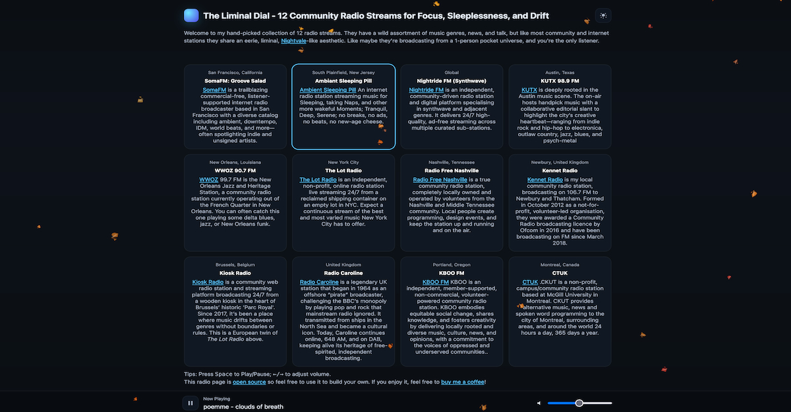

# 🎵 My "12 Radio Stations" Player

A simple, open-source web player for streaming curated internet radio stations.
Built with **vanilla HTML/CSS/JS**, no frameworks required.

It's running live at: [https://chris.funderburg.me/radio/](https://chris.funderburg.me/radio/)



---

## ✨ Features

- Lightweight, responsive UI
- Can switch between light and dark modes
- Station cards with name, description, and location
- Sticky player at the bottom of the page
- Keyboard shortcuts:
  - <kbd>Space</kbd> → Play / Pause
  - <kbd>←</kbd> / <kbd>→</kbd> → Adjust volume
- Remembers last station and volume across sessions
- Metadata support (`Now Playing`) for stations that expose APIs
- HTTPS support (required by many streams)
- Works with [HLS.js](https://github.com/video-dev/hls.js) for `.m3u8` streams
- Supports Album art where the stream publishes any
- Supports long show descriptions
- Should work well with screenreaders
- Plays nicely with Car Bluetooth on Android via Media Session API integration

---

## 📻 Stations:

```
Ambiant Sleeping Pill    - South Plainfield, New Jersey
Kennet Radio             - Newbury, United Kingdom
Kiosk Radio              - Brussels, Belgium            - New
KUTX 98.9 FM             - Austin, Texas
Nightride FM (Synthwave) - Tasmania, Australia
Radio Caroline           - United Kingdom               - New
Radio Free Nashville     - Nashville, Tennessee
SomaFM: Groove Salad     - San Francisco, California
The Lot Radio            - New York City
WWOZ 90.7 FM             - New Orleans, Louisiana
```

---

## 🚀 Getting Started

### Clone & run locally

```bash
git clone https://github.com/bocan/radio.git
cd radio
# Open index.html in your browser
```

### Customizing Stations

All stations are defined in radio.js.  Finding the raw stream URLs can be tricky. Try inspecting the network requests on the station's web player or searching online. Finding their metadata API (if it's available at all) is even trickier as they won't ever advertise it. The browser's developer tools are your friend here. Even once you find it, everyone does it differently. It could be json, xml, raw text, or even exotic formats, so you'll need to write a custom parser function for each one.

```js
const STATIONS = [
  {
    id: 'groove-salad',
    name: 'SomaFM: Groove Salad',
    location: 'San Francisco, US',
    description: 'Ambient / downtempo beats.',
    streams: [
      { url: 'https://ice1.somafm.com/groovesalad-128-mp3', type: 'audio/mpeg' }
    ],
    metadataUrl: 'https://somafm.com/songs/groovesalad.json',
    parseNowPlaying: data => {
      const s = Array.isArray(data?.songs) ? data.songs[0] : null;
      if (!s) return null;
      return `${s.artist} — ${s.title}`;
    }
  },
  // … more stations
];

```
To add your own station, append another object to this array.

### 📦 Deployment

Because this is a static site:

GitHub Pages → easiest option

Netlify / Vercel → drag-and-drop or link repo

Any static web server (Nginx, Apache, S3+CloudFront, etc.)
