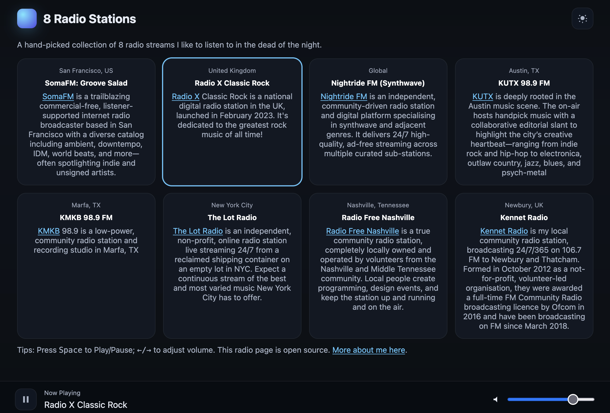

# 🎵 My "8 Radio Stations" Player

A simple, open-source web player for streaming curated internet radio stations.  
Built with **vanilla HTML/CSS/JS**, no frameworks required.



---

## ✨ Features

- Lightweight, responsive UI
- Station cards with name, description, and location
- Sticky player at the bottom of the page
- Keyboard shortcuts:
  - <kbd>Space</kbd> → Play / Pause
  - <kbd>←</kbd> / <kbd>→</kbd> → Adjust volume
- Remembers last station and volume across sessions
- Metadata support (`Now Playing`) for stations that expose APIs
- HTTPS support (required by many streams)
- Works with [HLS.js](https://github.com/video-dev/hls.js) for `.m3u8` streams

---

## 🚀 Getting Started

### Clone & run locally

```bash
git clone https://github.com/<your-username>/<your-repo>.git
cd <your-repo>
# Open index.html in your browser

